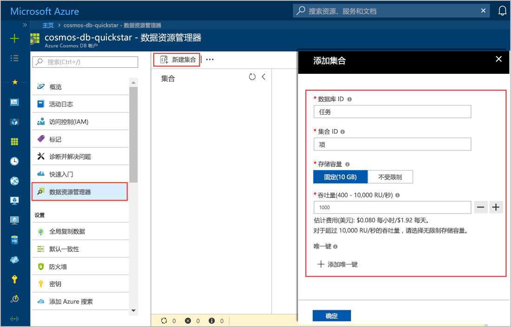

现在可以在 Azure 门户中使用数据资源管理器工具来创建数据库和集合。 

1. 单击“数据资源管理器” > “新建集合”。 

    “添加集合”区域显示在最右侧，可能需要向右滚动才能看到它。

    

2. 在“添加集合”页上，输入新集合的设置。

    设置|建议的值|说明
    ---|---|---
    数据库 ID|任务|输入 *Tasks* 作为新数据库的名称。 数据库名称必须包含 1 到 255 个字符，不能包含 /、\\、#、? 或尾随空格。
    集合 ID|Items|输入 *Items* 作为新集合的名称。 集合 ID 与数据库名称的字符要求相同。
    存储容量| 固定 (10 GB)|将值更改为“固定(10GB)”。 此值是数据库的存储容量。
    吞吐量|400 RU|将吞吐量更改为每秒 400 个请求单位 (RU/s)。 如果想要减少延迟，以后可以增加吞吐量。
    分区键|/category|一个分区键，用于将数据均匀分配到每个分区。 选择正确的分区键对于创建高性能集合而言很重要。 若要了解详细信息，请参阅[设计分区](../articles/cosmos-db/partition-data.md#designing-for-partitioning)。

    单击 **“确定”**。

    数据资源管理器将显示新的数据库和集合。

    
<!--Update_Description: wording update-->
<!--ms.date: 11/27/2017-->