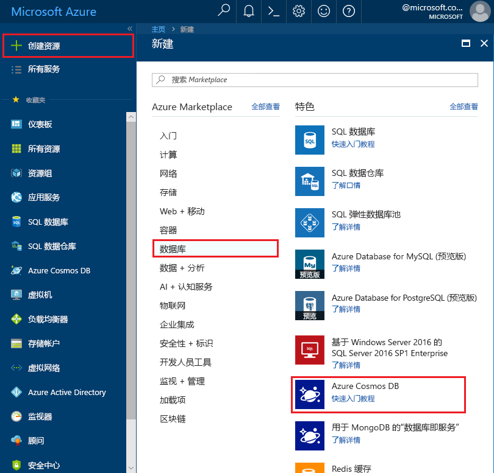
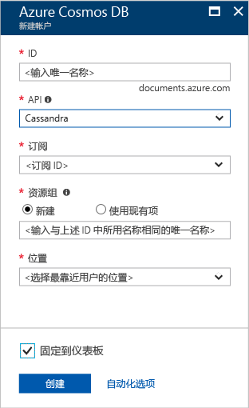

<!--Verify sucessfully-->
1. 在新浏览器窗口中，登录到 [Azure 门户](https://portal.azure.cn/)。

2. 选择“创建资源” > “数据库” > “Azure Cosmos DB”。

   

3. 在“创建 Azure Cosmos DB 帐户”页中，输入新 Azure Cosmos DB 帐户的设置。 

    设置|值|Description
    ---|---|---
    订阅|订阅|选择要用于此 Azure Cosmos DB 帐户的 Azure 订阅。 
    资源组|新建  然后输入在 ID 中提供的同一唯一名称|选择“新建”。 然后输入帐户的新资源组名称。 为简单起见，可以使用与 ID 相同的名称。 
    帐户名|输入唯一的名称|输入标识此 Azure Cosmos DB 帐户的唯一名称。 由于 documents.azure.cn 字符串将追加到所提供的 ID 后面以创建 URI，因此，请使用唯一的 ID。  该 ID 只能使用小写字母、数字和连字符 (-) 字符。 它的长度必须介于 3 到 31 个字符之间。
    API|Cassandra|API 确定要创建的帐户的类型。 Azure Cosmos DB 提供五种 API：适用于文档数据库的 Core(SQL)、适用于图形数据库的 Gremlin、适用于文档数据库的 MongoDB、Azure 表和 Cassandra。 目前，你必须为每种 API 创建单独的帐户。   选择“Cassandra”，因为本快速入门将创建使用 Cassandra API 的表。   [详细了解 Cassandra API](../articles/cosmos-db/cassandra-introduction.md)。|
    位置|选择离用户最近的区域|选择用于托管 Azure Cosmos DB 帐户的地理位置。 使用离用户最近的位置，使他们能够以最快的速度访问数据。

    选择“查看 + 创建”。 可以跳过“网络”和“标记”部分。 

    

4. 创建帐户需要几分钟时间。 等待门户中显示“祝贺你!已创建 Azure Cosmos DB 帐户”页。

<!--Verify sucessfully-->
<!--Update_Description: new articles on  -->
<!--ms.date: 03/18/2019-->