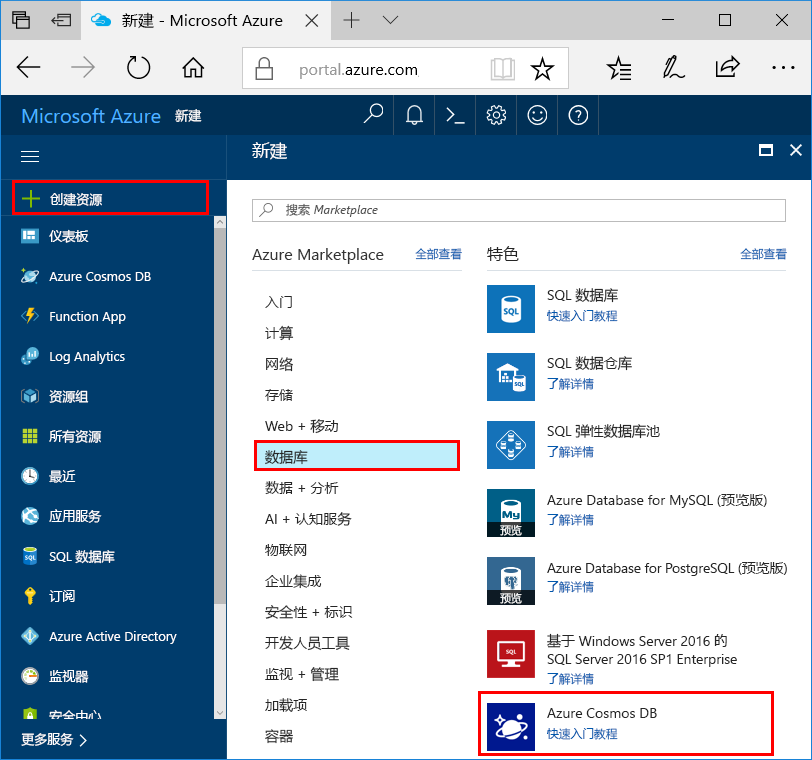

1. 在新窗口中，登录到 [Azure 门户](https://portal.azure.cn/)。
2. 在左侧菜单中，依次单击“新建”、“数据库”、“Azure Cosmos DB”。

   

3. 在“新建帐户”边栏选项卡中，为 Azure Cosmos DB 帐户指定所需的配置。 

    使用 Azure Cosmos DB，可以选择以下三个编程模型之一：MongoDB、SQL (DocumentDB) 和表（键/值）。 

    在本快速入门教程中，我们针对表 API 编程，因此，在填写表单时，请选择“表(键/值)”。 但如果有社交媒体应用的图形数据、来自目录应用的文档数据或从 MongoDB 应用迁移的数据，请意识到 Azure Cosmos DB 可以为所有任务关键型应用程序提供高度可用的全球分布式数据库服务平台。

    使用作为指南的屏幕截图中的信息填写“新建帐户”边栏选项卡。 设置帐户时你将选择唯一的值，因此你的值不会与屏幕截图完全匹配。 

    

    设置|建议的值|说明
    ---|---|---
    ID|*唯一值*|选择用于标识 Azure Cosmos DB 帐户的唯一名称。 *documents.azure.cn* 会追加到所提供的 ID 以创建 URI，因此，请使用唯一但可识别的 ID。 ID 只能包含小写字母、数字及“-”字符，且长度必须为 3 到 50 个字符。
    API|表（键/值）|在本文的后面部分中，我们针对[表 API](../articles/cosmos-db/table-introduction.md) 编程。|
    订阅|
            *订阅*|要用于 Azure Cosmos DB 帐户的 Azure 订阅。 
    资源组|*与 ID 相同的值*|帐户的新资源组名称。 为简单起见，可以使用与 ID 相同的名称。 
    位置|
            *离用户最近的区域*|要在其中托管 Azure Cosmos DB 帐户的地理位置。 选择离用户最近的位置，使其能够以最快的速度访问数据。   

4. 单击“创建”  以创建帐户。
5. 在工具栏上，单击“通知”可监视部署过程。

    

6.  部署完成后，请从“所有资源”磁贴打开新帐户。 

    