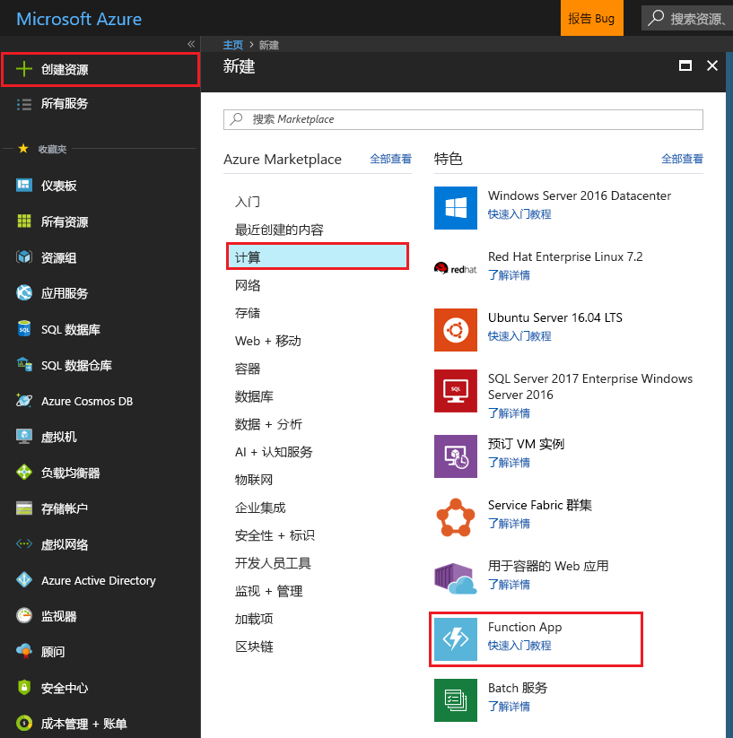

1. 选择 Azure 门户左上角的“新建”按钮，然后选择“计算” > “Function App”。 

    

2. 使用图像下面的表格中指定的函数应用设置。

    

    | 设置      | 建议的值  | 说明                                        |
    | ------------ |  ------- | -------------------------------------------------- |
    | **应用名称** | 全局唯一名称 | 用于标识新 Function App 的名称。 有效的字符是 `a-z`、`0-9` 和 `-`。  | 
    | **订阅** | 你的订阅 | 要在其下创建此新函数应用的订阅。 | 
    | [资源组](../articles/azure-resource-manager/resource-group-overview.md) |  MyResourceGroup | 要在其中创建 Function App 的新资源组的名称。 | 
    | **[存储](../articles/storage/common/storage-create-storage-account.md#create-a-storage-account)** |  全局唯一名称 |  Function App 使用的新存储帐户的名称。 存储帐户名称必须为 3 到 24 个字符，并且只能包含数字和小写字母。 也可以使用现有帐户。 |
    | **应用服务计划/位置** | | 应用服务计划是应用的容器。 应用服务计划的设置确定与应用关联的位置、功能、成本和计算资源。

3. 选择“创建”以预配和部署函数应用。 

4. 选择门户右上角的“通知”图标，留意是否显示“部署成功”消息。 

    

4. 选择“转到资源”，查看新的函数应用。

>[!TIP]
>如果在门户中找不到函数应用，请尝试[将 Function App 添加到 Azure 门户中的收藏夹](../articles/azure-functions/functions-how-to-use-azure-function-app-settings.md#favorite)。   

