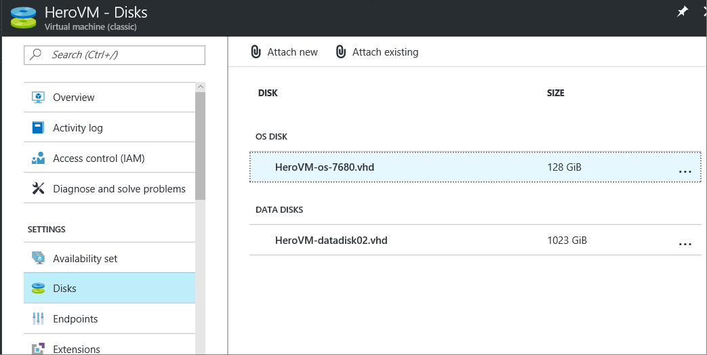
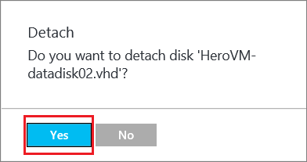

不再需要附加到虚拟机的数据磁盘时，可以轻松地分离它。 分离磁盘会将该磁盘从虚拟机中删除，但不会从 Azure 存储帐户中删除该磁盘。

如果希望再次使用磁盘上的现有数据，可以将其重新附加到相同的虚拟机或另一个虚拟机。  

> [!NOTE]
> 若要分离操作系统磁盘，首先需要删除虚拟机。
>

## 找到磁盘
如果不知道磁盘名称或要在分离磁盘之前验证磁盘名称，请按照以下步骤进行操作。

1. 登录到 [Azure 门户](https://portal.azure.cn)。

2. 单击“虚拟机”，并选择相应的 VM。

3. 在虚拟机仪表板左侧边缘上，单击“设置”下的“磁盘”。

 虚拟机仪表板列出所有附加的磁盘的名称和类型。 例如，此屏幕显示带有一个操作系统 (OS) 磁盘和一个数据磁盘的虚拟机：

    

## 分离磁盘
1. 在 Azure 门户中，单击“虚拟机”，然后单击其数据磁盘需要进行分离的虚拟机的名称。

2. 在虚拟机仪表板左侧边缘上，单击“设置”下的“磁盘”。

3. 单击想要分离的磁盘。

  

4. 在命令栏中，单击“分离”。

  

5. 在确认窗口中，单击“是”以分离该磁盘。

  

磁盘保留在存储中，但不再附加到虚拟机。