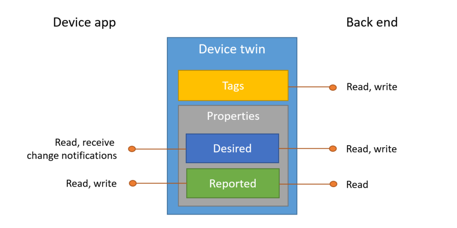

> [!div class="op_single_selector"]
> * [Node.js](../articles/iot-hub/iot-hub-node-node-twin-getstarted.md)
> * [.NET](../articles/iot-hub/iot-hub-csharp-csharp-twin-getstarted.md)
> * [Java](../articles/iot-hub/iot-hub-java-java-twin-getstarted.md)
> * [Python](../articles/iot-hub/iot-hub-python-twin-getstarted.md)

设备孪生是存储设备状态信息（包括元数据、配置和条件）的 JSON 文档。 IoT 中心为连接到它的每台设备保留一个设备孪生。

[!INCLUDE [iot-hub-basic](iot-hub-basic-whole.md)]

使用设备孪生可以：

* 存储来自解决方案后端的设备元数据。

* 通过设备应用报告当前状态信息，例如可用功能和条件（例如，使用的连接方法）。

* 同步设备应用和后端应用之间长时间运行的工作流的状态（例如固件和配置更新）。

* 查询设备的元数据、配置或状态。

设备孪生旨在执行同步以及查询设备的配置和条件。 [了解设备孪生](../articles/iot-hub/iot-hub-devguide-device-twins.md)中提供了有关何时使用设备孪生的详细信息。

设备孪生存储在 IoT 中心内，并且包含以下元素：

* **标记**。 仅可由解决方案后端访问的设备元数据。

* **所需的属性**。 可以由解决方案后端修改并可由设备应用观察的 JSON 对象。

* **报告的属性**。 可由设备应用修改并可由解决方案后端读取的 JSON 对象。

标记和属性不能包含数组，但可以嵌套对象。

下图显示了设备孪生组织：

此外，解决方案后端可以根据上述所有数据查询设备孪生。
有关设备孪生的详细信息，请参阅[了解设备孪生](../articles/iot-hub/iot-hub-devguide-device-twins.md)。 有关查询的详细信息，请参阅 [IoT 中心查询语言](../articles/iot-hub/iot-hub-devguide-query-language.md)。

本教程演示如何：

* 创建将标记添加到设备孪生的后端应用，以及将其连接通道作为设备孪生上的报告属性进行报告的模拟设备应用。

* 使用标记上的筛选器和之前创建的属性通过后端应用查询设备。

<!-- images -->
[img-twin]: media/iot-hub-selector-twin-get-started/twin.png

<!-- links -->
[lnk-query]: ../articles/iot-hub/iot-hub-devguide-query-language.md
[lnk-twins]: ../articles/iot-hub/iot-hub-devguide-device-twins.md
[lnk-d2c]: ../articles/iot-hub/iot-hub-devguide-messaging.md#device-to-cloud-messages
[lnk-methods]: ../articles/iot-hub/iot-hub-devguide-direct-methods.md
[lnk-devguide-mqtt]: ../articles/iot-hub/iot-hub-mqtt-support.md