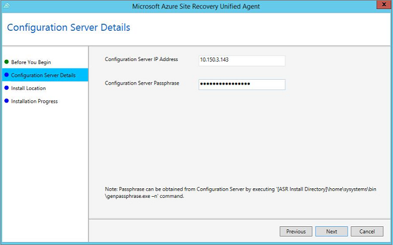

### 安装移动服务
<a id="install-the-mobility-service" class="xliff"></a>
为虚拟机和物理服务器启用保护时，第一步是安装移动服务。 可以通过多种方式实现此目的：

* **进程服务器推送**：在计算机上启用复制时，将从进程服务器推送并安装移动服务组件。 
*请注意* ，如果计算机已在运行最新版本的组件，则不会执行推送安装。
* 企业推送：使用企业推送过程（例如 WSUS、System Center Configuration Manager 或 [Azure 自动化和 Desired State configuration](../articles/site-recovery/site-recovery-automate-mobility-service-install.md)）自动安装该组件。 执行此操作之前，请设置配置服务器。
* **手动安装**：在要复制的每台计算机上手动安装该组件。 执行此操作之前，请设置配置服务器。

#### 准备在 Windows 计算机上自动推送
<a id="prepare-for-automatic-push-on-windows-machines" class="xliff"></a>
下面介绍了如何准备 Windows 计算机，以便进程服务器能够自动安装移动服务。

1. 创建可供进程服务器用来访问计算机的帐户。 该帐户应具有管理员权限（本地或域），并且仅用于推送安装。

   > [!NOTE]
   > 如果使用的不是域帐户，则需在本地计算机上禁用远程用户访问控制。 为此，请在注册表中的 HKEY_LOCAL_MACHINE\SOFTWARE\Microsoft\Windows\CurrentVersion\Policies\System 下添加值为 1 的 DWORD 项 LocalAccountTokenFilterPolicy。 若要从 CLI 添加该注册表项，请键入 **`REG ADD HKEY_LOCAL_MACHINE\SOFTWARE\Microsoft\Windows\CurrentVersion\Policies\System /v LocalAccountTokenFilterPolicy /t REG_DWORD /d 1`**。
   >
   >
2. 在要保护的计算机的 Windows 防火墙中，选择“允许应用或功能通过防火墙”。 启用“文件和打印机共享”和“Windows Management Instrumentation”。 对于属于某个域的计算机，可以使用 GPO 配置防火墙设置。

   
3. 添加已创建的帐户：

   * 打开 **cspsconfigtool**。 该工具已作为快捷方式在桌面上提供，也可以在 [安装位置]\home\svsystems\bin 文件夹中找到。
   * 在“管理帐户”选项卡中，单击“添加帐户”。
   * 添加已创建的帐户。 添加帐户后，在为计算机启用复制时，需要提供这些凭据。

#### 准备在 Linux 服务器上自动推送
<a id="prepare-for-automatic-push-on-linux-servers" class="xliff"></a>
1. 确保要保护的 Linux 计算机受支持，如 [受保护的计算机先决条件](#protected-machine-prerequisites)中所述。 确保 Linux 计算机与进程服务器之间已建立网络连接。
2. 创建可供进程服务器用来访问计算机的帐户。 该帐户应是源 Linux 服务器上的 root 用户，仅用于推送安装。

   * 打开 **cspsconfigtool**。 该工具已作为快捷方式在桌面上提供，也可以在 [安装位置]\home\svsystems\bin 文件夹中找到。
   * 在“管理帐户”选项卡中，单击“添加帐户”。
   * 添加已创建的帐户。 添加帐户后，在为计算机启用复制时，需要提供这些凭据。
3. 确保源 Linux 服务器上的 /etc/hosts 文件包含用于将本地主机名映射到所有网络适配器关联的 IP 地址的条目。
4. 在要复制的计算机上安装最新的 openssh、openssh-server 和 openssl 包。
5. 确保 SSH 已启用且正在端口 22 上运行。
6. 在 sshd_config 文件中启用 SFTP 子系统与密码身份验证，如下所示：

   * 以 root 身份登录。
   * 在文件 /etc/ssh/sshd_config 中，找到以“PasswordAuthentication”开头的行。
   * 取消注释该行，并将值从“no”更改为“yes”。
   * 找到以“Subsystem”开头的行，并取消注释该行。

     

### 手动安装移动服务
<a id="install-the-mobility-service-manually" class="xliff"></a>
配置服务器上的 C:\Program Files (x86)\Microsoft Azure Site Recovery\home\svsystems\pushinstallsvc\repository 中提供了安装程序。

| 源操作系统 | 移动服务安装文件 |
| --- | --- |
| Windows Server（仅限 64 位） |Microsoft-ASR_UA_9.0.0_Windows_ release.exe |
| CentOS 6.4、6.5、6.6（仅限 64 位） |Microsoft-ASR_UA_9.0.0_RHEL6-64_release.tar.gz |
| SUSE Linux Enterprise Server 11 SP3（仅限 64 位） |Microsoft-ASR_UA_9.0.0_SLES11-SP3-64_release.tar.gz |
| Oracle Enterprise Linux 6.4、6.5（仅限 64 位） |Microsoft-ASR_UA_9.0.0_OL6-64_release.tar.gz |

#### 在 Windows Server 上安装移动服务
<a id="install-mobility-service-on-a-windows-server" class="xliff"></a>
1. 下载并运行相关安装程序。
2. 在“开始之前”中选择“移动服务”。

    
3. 在“配置服务器详细信息”中，指定配置服务器的 IP 地址，以及运行统一安装程序时生成的通行短语。 可以通过在配置服务器上运行以下命令来检索通行短语：<SiteRecoveryInstallationFolder>\home\sysystems\bin\genpassphrase.exe –v。

    
4. 保留“安装位置”中的默认设置，然后单击“下一步”开始安装。
5. 在“安装进度”中监视安装过程，并在系统提示的情况下重启计算机。 安装该服务后，可能需要大约 15 分钟，状态才会在门户中更新。

#### 使用命令提示符在 Windows Server 上安装移动服务
<a id="install-mobility-service-on-a-windows-server-using-the-command-prompt" class="xliff"></a>
1. 将安装程序复制到要保护的服务器上的某个本地文件夹（如 C:\Temp）。 可以在配置服务器上的 [安装位置]\home\svsystems\pushinstallsvc\repository 中找到安装程序。 适用于 Windows 操作系统的包的名称类似于 Microsoft-ASR_UA_9.3.0.0_Windows_GA_17thAug2016_release.exe
2. 请将此文件重命名为 MobilitySvcInstaller.exe
3. 运行以下命令解压缩 MSI 安装程序：

    ``C:\> cd C:\Tempww
    ``C:\Temp> MobilitySvcInstaller.exe /q /xC:\Temp\Extracted``
    ``C:\Temp> cd Extracted``
    ``C:\Temp\Extracted> UnifiedAgent.exe /Role "Agent" /CSEndpoint "IP Address of Configuration Server" /PassphraseFilePath <Full path to the passphrase file>``

##### 完整命令行语法
<a id="full-command-line-syntax" class="xliff"></a>
```
UnifiedAgent.exe [/Role <Agent/MasterTarget>] [/InstallLocation <Installation Directory>] [/CSIP <IP address of CS to be registered with>] [/PassphraseFilePath <Passphrase file path>] [/LogFilePath <Log File Path>]<br/>
```

**Parameters**

* **/Role：** 必需。 指定是否应安装移动服务。 输入值 Agent|MasterTarget
* **/InstallLocation：** 必需。 指定服务安装位置。
* **/PassphraseFilePath：** 必需。 配置服务器通行短语。
* **/LogFilePath：** 必需。 应在其中创建安装日志文件的位置。

#### 手动卸载移动服务
<a id="uninstall-the-mobility-service-manually" class="xliff"></a>
可以使用控制面板中的“添加/删除程序”或使用以下命令行指令卸载移动服务：MsiExec.exe /qn /x {275197FC-14FD-4560-A5EB-38217F80CBD1}

#### 在 Linux 服务器上安装移动服务
<a id="install-the-mobility-service-on-a-linux-server" class="xliff"></a>
1. 根据上表，将相应的 tar 存档复制到要复制的 Linux 计算机。
2. 打开 shell 程序，然后运行 `tar -xvzf Microsoft-ASR_UA_8.5.0.0*`
3. 在 tar 存档内容解压缩到的本地目录中创建 passphrase.txt 文件。 为此，请在配置服务器上从 C:\ProgramData\Microsoft Azure Site Recovery\private\connection.passphrase 复制通行短语，然后通过在 shell 中运行 `echo <passphrase> >passphrase.txt`，将其保存在 passphrase.txt 中。
4. 运行 *`sudo ./install -t both -a host -R Agent -d /usr/local/ASR -i <IP address> -p <port> -s y -c https -P passphrase.txt`*以安装移动服务。
5. 指定配置服务器的内部 IP 地址，确保选择端口 443。 安装该服务后，可能需要大约 15 分钟，状态才会在门户中更新。

**也可以从命令行安装**：

在配置服务器上从 C:\Program Files (x86)\InMage Systems\private\connection 复制通行短语，然后在配置服务器上将其另存为“passphrase.txt”。 然后运行这些命令。 在本示例中，配置服务器 IP 地址为 104.40.75.37，HTTPS 端口应该为 443：

在生产服务器上安装：

```
./install -t both -a host -R Agent -d /usr/local/ASR -i 104.40.75.37 -p 443 -s y -c https -P passphrase.txt
```

在主目标服务器上安装：

```
./install -t both -a host -R MasterTarget -d /usr/local/ASR -i 104.40.75.37 -p 443 -s y -c https -P passphrase.txt
```