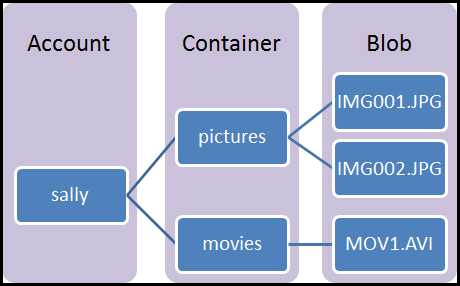

Azure Blob 存储是 Azure 的适用于云的对象存储解决方案。 Blob 存储最适合存储巨量的非结构化数据，例如文本或二进制数据。

Blob 存储最适合用于：

* 直接向浏览器提供图像或文档。
* 存储文件以供分布式访问。
* 对视频和音频进行流式处理。
* 向日志文件进行写入。
* 存储用于备份和还原、灾难恢复及存档的数据。
* 存储数据以供本地或 Azure 托管服务执行分析。

可以通过 HTTP 或 HTTPS 从世界上的任何位置访问 Blob 存储中的对象。 用户或客户端应用程序可以通过 URL、[Azure 存储 REST API](https://docs.microsoft.com/rest/api/storageservices/blob-service-rest-api)、[Azure PowerShell](https://docs.microsoft.com/powershell/module/azure.storage)、[Azure CLI](https://docs.azure.cn/cli/storage) 或 Azure 存储客户端库访问 Blob。 存储客户端库以多种语言提供，包括 [.NET](https://docs.azure.cn/dotnet/api/overview/storage/client)、[Java](https://docs.azure.cn/java/api/overview/storage/client)、[Node.js](http://azure.github.io/azure-storage-node)、[Python](https://azure-storage.readthedocs.io/en/latest/index.html)、[PHP](http://azure.github.io/azure-storage-php/) 和 [Ruby](http://azure.github.io/azure-storage-ruby)。

## Blob 服务概念

Blob 存储公开了三种资源：存储帐户、帐户中的容器，以及容器中的 blob。 以下图示显示了这些资源之间的关系。

### 存储帐户

对 Azure 存储中所有数据对象的访问都是通过存储帐户进行的。 有关详细信息，请参阅[关于 Azure 存储帐户](../articles/storage/common/storage-create-storage-account.md?toc=%2fstorage%2fblobs%2ftoc.json)。

### 容器

容器对一组 blob 进行组织，类似于文件系统中的文件夹。 所有 Blob 都驻留在容器中。 一个存储帐户可以包含无限数量的容器，一个容器可以存储无限数量的 Blob。 请注意，容器名称必须小写。

### Blob
 
Azure 存储提供三种类型的 Blob：块 Blob、追加 Blob 和[页 Blob](../articles/storage/blobs/storage-blob-pageblob-overview.md)（用于 VHD 文件）。

* 块 Blob 存储文本和二进制数据，最多约为 4.7 TB。 块 Blob 由可以分别管理的数据块构成。
* 与块 Blob 一样，追加 Blob 也由块构成，但针对追加操作进行了优化。 追加 Blob 非常适用于诸如记录来自虚拟机的数据之类的场景。
* 页 Blob 用于存储最大 8 TB 的随机访问文件。 页 Blob 存储着为 VM 提供支撑的 VHD 文件。

所有 Blob 都驻留在容器中。 容器类似于文件系统中的文件夹。 你可以进一步将 Blob 组织到虚拟目录中，并遍历它们，就像对待文件系统一样。 

如果使用的是极大型数据集，并且因网络限制而无法通过网络向 Blob 存储上传数据或从其下载数据，则可将一组硬盘驱动器寄送到世纪互联，以便直接通过数据中心导入或导出数据。 有关详细信息，请参阅[使用 Azure 导入/导出服务将数据传输到 Blob 存储](../articles/storage/common/storage-import-export-service.md)。
  
有关命名容器和 Blob 的详细信息，请参阅 [命名和引用容器、Blob 和元数据](https://docs.microsoft.com/rest/api/storageservices/Naming-and-Referencing-Containers--Blobs--and-Metadata)。

### 容器

容器对一组 blob 进行组织，类似于文件系统中的文件夹。 所有 Blob 都驻留在容器中。 一个存储帐户可以包含无限数量的容器，一个容器可以存储无限数量的 Blob。 请注意，容器名称必须小写。

### Blob
 
Azure 存储提供三种类型的 Blob：块 Blob、追加 Blob 和[页 Blob](../articles/storage/blobs/storage-blob-pageblob-overview.md)（用于 VHD 文件）。

* 块 Blob 存储文本和二进制数据，最多约为 4.7 TB。 块 Blob 由可以分别管理的数据块构成。
* 与块 Blob 一样，追加 Blob 也由块构成，但针对追加操作进行了优化。 追加 Blob 非常适用于诸如记录来自虚拟机的数据之类的场景。
* 页 Blob 用于存储最大 8 TB 的随机访问文件。 页 Blob 存储着为 VM 提供支撑的 VHD 文件。

所有 Blob 都驻留在容器中。 容器类似于文件系统中的文件夹。 你可以进一步将 Blob 组织到虚拟目录中，并遍历它们，就像对待文件系统一样。 

如果使用的是极大型数据集，并且因网络限制而无法通过网络向 Blob 存储上传数据或从其下载数据，则可将一组硬盘驱动器寄送给我们，以便直接通过数据中心导入或导出数据。 有关详细信息，请参阅[使用 Azure 导入/导出服务将数据传输到 Blob 存储](../articles/storage/common/storage-import-export-service.md)。
  
有关命名容器和 Blob 的详细信息，请参阅 [命名和引用容器、Blob 和元数据](/rest/api/storageservices/Naming-and-Referencing-Containers--Blobs--and-Metadata)。
