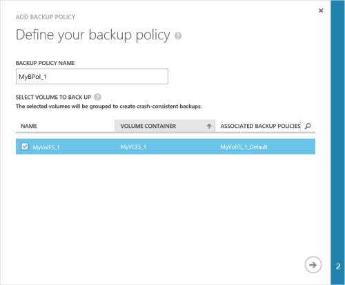

### 执行备份

1. 在设备“快速启动”页上，单击“添加备份策略”。 这将启动“添加备份策略”向导。 

2. 在“定义备份策略”页上：
  1. 为备份策略提供名称（包含 3 到 150 个字符）。
  2. 选择要备份的卷。 如果选择多个卷，这些卷将组合在一起，创建在崩溃时保持一致的备份。
  3. 单击箭头图标 。 

    

3. 在“定义计划”页上：
  1. 从下拉列表中选择备份类型。 要用于快速还原，请选择“本地快照”。 要用于数据复原，请选择“云快照”。
  2. 指定备份频率，以分钟、小时、天或周为单位。
  3. 选择保留时间。 保留期选项取决于备份频率。 例如，对于每日策略，以周为单位指定保留期；对于每月策略，则以月为单位指定保留期。
  4. 选择备份策略的开始时间和日期。
  5. 选择“启用”复选框启用备份策略。 
  6. 单击勾号图标  保存策略。

    

     现在，已有了一个创建卷数据的计划备份的备份策略。

设备配置已完成。