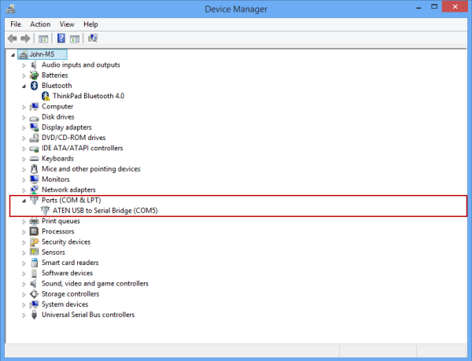

### 通过串行控制台进行连接

1. 将串行电缆连接到设备（直接连接或通过 USB 串行适配器连接）。

2. 打开“控制面板”，然后打开“设备管理器”。

3. 标识 COM 端口（如下图所示）。

     

4. 启动 PuTTY。 

5. 在右侧窗格中，将“连接类型”更改为“串行”。

6. 在右侧窗格中，键入相应的 COM 端口。 确保串行配置参数设置如下：
  - 速度：115,200
  - 数据位：8
  - 停止位：1
  - 奇偶校验：无
  - 流控制：无

    这些设置如下图所示。

      

    > [!NOTE]
    > 如果默认的流控制设置不起作用，请尝试将流控制设置为 XON/XOFF。

7. 单击“打开”启动串行会话。