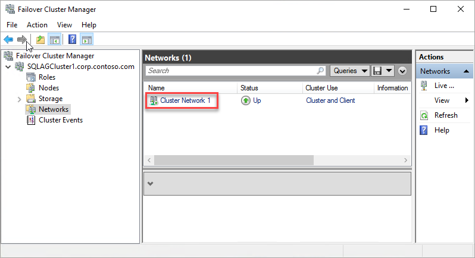
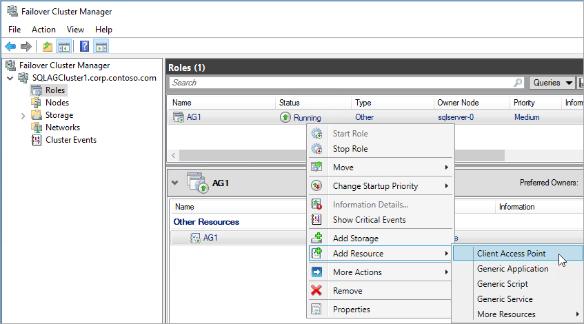
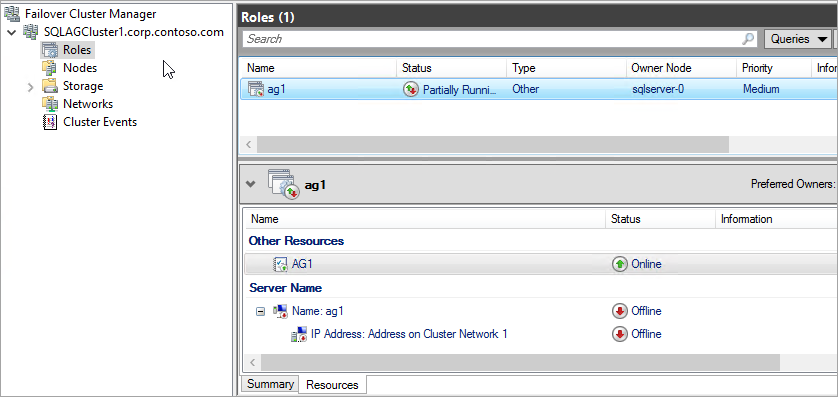
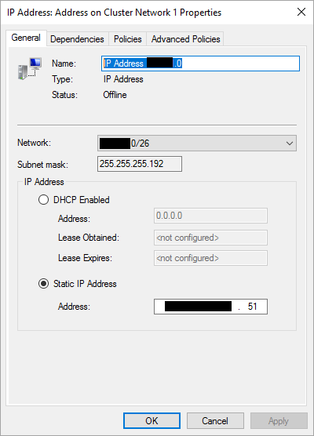
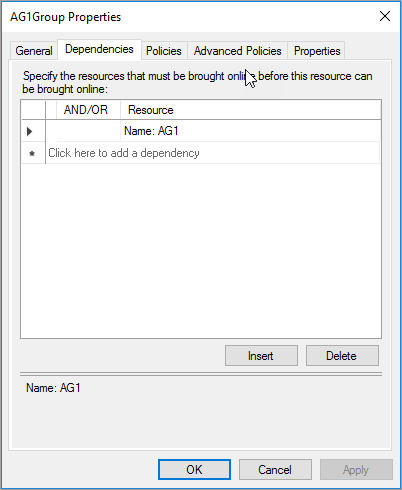
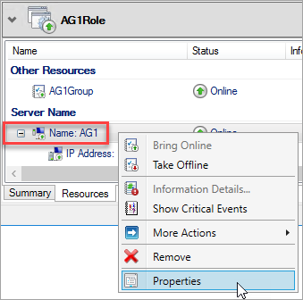
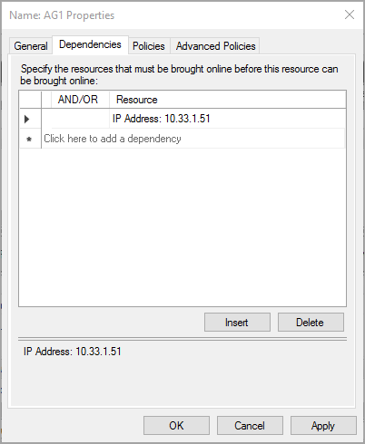

可用性组侦听器是 SQL Server 可用性组侦听的 IP 地址和网络名称。 若要创建可用性组侦听器，请执行以下步骤：

1. [获取群集网络资源的名称](#getnet)。

1. [添加客户端接入点](#addcap)。

1. [配置可用性组的 IP 资源](#congroup)。

1. [使 SQL Server 可用性组资源依赖于该客户端接入点](#dependencyGroup)

1. [使客户端接入点资源依赖于 IP 地址](#listname)。

1. [在 PowerShell 中设置群集参数](#setparam)。

以下部分提供其中每个步骤的详细说明。 

#### <a name="getnet"></a>获取群集网络资源的名称

1. 使用 RDP 连接到托管主副本的 Azure 虚拟机。 

1. 打开故障转移群集管理器。

1. 选择“网络”节点，并记下群集网络名称。 将在 PowerShell 脚本的 `$ClusterNetworkName` 变量中使用此名称。

    在下图中，群集网络名称是“群集网络 1” ：

    

#### <a name="addcap"></a>添加客户端接入点

客户端接入点是应用程序用来连接到可用性组中的数据库的网络名称。 可在故障转移群集管理器中创建客户端接入点。 

1. 展开群集名称，然后单击“角色”。

1. 在“角色”窗格中，右键单击可用性组名称，然后选择“添加资源” > “客户端接入点”。

    

1. 在“名称”框中，创建新侦听器的名称。 

    新侦听器的名称是应用程序用来连接 SQL Server 可用性组中数据库的网络名称。

    若要完成创建侦听器，请单击“下一步”两次，然后单击“完成”。 不要在此时使侦听器或资源联机。

#### <a name="congroup"></a>配置可用性组的 IP 资源

1. 单击“资源”选项卡，然后展开创建的客户端接入点。 客户端接入点处于脱机状态。

     

1. 右键单击 IP 资源，然后单击“属性”。 记下 IP 地址的名称。 将在 PowerShell 脚本的 `$IPResourceName` 变量中使用此名称。

1. 在“IP 地址”下面，单击“静态 IP 地址”。 将 IP 地址设置为在 Azure 门户预览版上设置负载均衡器地址时所用的相同地址。

     

<!-----------------------I don't see this option on server 2016
1. Disable NetBIOS for this address and click **OK**. Repeat this step for each IP resource if your solution spans multiple Azure VNets. 
------------------------->

#### <a name = "dependencyGroup"></a>使 SQL Server 可用性组资源依赖于客户端接入点

1. 在故障转移群集管理器中单击“角色”，然后单击你的可用性组。

1. 在“资源”选项卡中，右键单击“服务器名称”下面的可用性资源组，然后单击“属性”。 

1. 在依赖关系选项卡中添加名称资源。 此资源是客户端接入点。 

     

1. 单击“确定” 。

#### <a name="listname"></a>使客户端接入点资源依赖于 IP 地址

1. 在故障转移群集管理器中单击“角色”，然后单击你的可用性组。 

1. 在“资源”选项卡中，右键单击“服务器名称”下面的客户端接入点资源，然后单击“属性”。 

     

1. 选择“依赖项”选项卡。 在侦听器资源名称中设置依赖关系。 如果有多个资源列出，请验证 IP 地址具有 OR 而不是 AND 依赖项。 单击 **“确定”**。 

     

1. 右键单击侦听器名称，然后单击“联机”。 

#### <a name="setparam"></a>在 PowerShell 中设置群集参数

1. 将以下 PowerShell 脚本复制到一台 SQL Server。 请更新环境的变量。     

    ```PowerShell
    $ClusterNetworkName = "<MyClusterNetworkName>" # the cluster network name (Use Get-ClusterNetwork on Windows Server 2012 of higher to find the name)
    $IPResourceName = "<IPResourceName>" # the IP Address resource name
    $ILBIP = "<n.n.n.n>" # the IP Address of the Internal Load Balancer (ILB). This is the static IP address for the load balancer you configured in the Azure portal preview.
    [int]$ProbePort = <nnnnn>

    Import-Module FailoverClusters

    Get-ClusterResource $IPResourceName | Set-ClusterParameter -Multiple @{"Address"="$ILBIP";"ProbePort"=$ProbePort;"SubnetMask"="255.255.255.255";"Network"="$ClusterNetworkName";"EnableDhcp"=0}
    ```

2. 通过在某个群集节点上运行 PowerShell 脚本设置群集参数。  

> [!NOTE]
> 如果 SQL Server 位于不同的区域，则需要运行 PowerShell 脚本两次。 第一次运行时，请从第一个区域中选择 `$ILBIP` 和 `$ProbePort`。 第二次运行时，请从第二个区域中选择 `$ILBIP` 和 `$ProbePort`。 群集网络名称与群集 IP 资源名称相同。