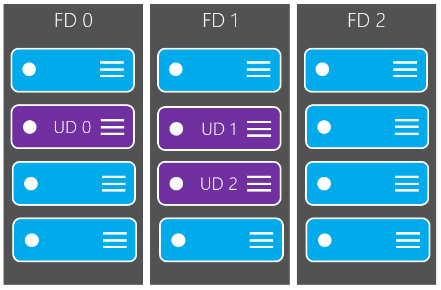

# Azure 中虚拟机的区域和可用性
Azure 在中国的四个数据中心运行。 这些数据中心分组到地理区域，让用户可灵活选择构建应用程序的位置。 请务必了解 Azure 中虚拟机 (VM) 运行的方式和位置，以及最大化性能、可用性和冗余的选项。 本文提供了 Azure 的可用性和冗余功能的概述。

<!--Notice: multiple TO four -->
<!--Notice: around the world TO China -->

## 什么是 Azure 区域？
可以在规定的地理区域（例如“中国东部”、“中国东部 2”、“中国北部”或“中国北部 2”）中创建 Azure 资源。 可查看[区域及其位置的列表](https://www.azure.cn/support/service-dashboard/)。 为了提供冗余和可用性，每个区域都设有多个数据中心。 这样，便可灵活设计应用程序，创建距离用户最近的 VM，满足任何法律、符合性或税务要求。

<!-- China Region contains 'China East', 'China East 2 ', 'China North', or 'China North 2 '-->

<!-- Not Available on ## Special Azure regions

## Region pairs
Each Azure region is paired with another region within the same geography. This approach allows for the replication of resources, such as VM storage, across a geography that should reduce the likelihood of natural disasters, civil unrest, power outages, or physical network outages affecting both regions at once. Additional advantages of region pairs include:

* In the event of a wider Azure outage, one region is prioritized out of every pair to help reduce the time to restore for applications. 
* Planned Azure updates are rolled out to paired regions one at a time to minimize downtime and risk of application outage.
* Data continues to reside within the same geography as its pair (except for Brazil South) for tax and law enforcement jurisdiction purposes.

Examples of region pairs include:

| Primary | Secondary |
|:--- |:--- |
| China North |China East |
| China North 2 |China East 2 |

<!-- Not Available on  [list of regional pairs here](../articles/best-practices-availability-paired-regions.md#what-are-paired-regions) -->
## 功能可用性
某些服务或 VM 功能（例如特定的 VM 大小或存储类型）仅在特定区域提供。 也有一些全球性 Azure 服务不需要选择特定的区域，例如 [Azure Active Directory](../articles/active-directory/fundamentals/active-directory-whatis.md)、[流量管理器](../articles/traffic-manager/traffic-manager-overview.md)或 Azure DNS。 若要更好地设计应用程序环境，可查看 [Azure 服务在每个区域的可用性](https://www.azure.cn/support/service-dashboard/#services)。 此外，还可以[以编程方式查询受支持的 VM 大小和每个区域中的限制](../articles/azure-resource-manager/resource-manager-sku-not-available-errors.md)。

<!-- URL waiting for release on [Azure DNS](../articles/dns/dns-overview.md) -->

## 存储可用性
在考虑可用的存储复制选项时，了解 Azure 区域和地理位置变得相当重要。 根据存储类型，用户可以使用不同的复制选项。

**Azure 托管磁盘**
* 本地冗余存储 (LRS)
  * 在创建存储帐户时所在的区域复制数据三次。

**基于存储帐户的磁盘**
* 本地冗余存储 (LRS)
  * 在创建存储帐户时所在的区域复制数据三次。
* 区域冗余存储 (ZRS)
  * 在两到三个设施之间复制数据三次（在单个区域内或两个区域之间）。
* 异地冗余存储 (GRS)
  * 将数据复制到距主要区域数百英里以外的次要区域。
* 读取访问异地冗余存储 (RA-GRS)
  * 与 GRS 一样，可将数据复制到次要区域，但此外还提供对次要位置中数据的只读访问权限。

下表提供存储复制类型之间差异的简要概述：

| 复制策略 | LRS | ZRS | GRS | RA-GRS |
|:--- |:--- |:--- |:--- |:--- |
| 数据在多个设施之间进行复制。 |否 |是 |是 |是 |
| 可以从辅助位置和主位置读取数据。 |否 |否 |否 |是 |
| 在单独的节点上维护的数据副本数。 |3 |3 |6 |6 |

可以在[此处](../articles/storage/common/storage-redundancy.md)详细了解 Azure 存储复制选项。 有关托管磁盘的详细信息，请参阅 [Azure 托管磁盘概述](../articles/virtual-machines/windows/managed-disks-overview.md)。

### 存储费用
价格根据所选存储类型和可用性的不同而异。

**Azure 托管磁盘**
* 高级托管磁盘受固态硬盘 (SSD) 支持，标准托管磁盘受常规旋转磁盘支持。 高级和标准托管磁盘均按预配的磁盘容量计费。

**非托管磁盘**
* 高级存储以固态硬盘 (SSD) 为基础，收费方式根据磁盘容量而定。
* 标准存储以普通的旋转式磁盘为基础，收费方式根据所用容量和所需的存储可用性而定。
  * 对于 RA-GRS，有一个额外的异地复制数据传输费用，它是将该数据复制到另一个 Azure 区域收取的带宽费用。

有关不同存储类型和可用性选项的定价信息，请参阅 [Azure 存储器定价](https://www.azure.cn/pricing/details/storage/)。

## 可用性集
可用性集是数据中心内的 VM 的逻辑分组，可让 Azure 了解应用程序的构建方式，以便提供冗余和可用性。 建议在可用性集内创建两个或多个 VM，提供高度可用的应用程序，并满足 [99.95% Azure SLA](https://www.azure.cn/support/sla/virtual-machines/) 的要求。 可用性集本身是免费的，只需为创建的每个 VM 实例付费。 当单个 VM 使用 [Azure 高级存储](../articles/virtual-machines/windows/premium-storage.md)时，Azure SLA 适用于计划外维护事件。 

可用性集由可防止硬件故障以及允许安全应用更新的两个额外分组构成 - 容错域 (FD) 和更新域 (UD)。 详细了解如何管理 [Linux VM](../articles/virtual-machines/linux/manage-availability.md) 或 [Windows VM](../articles/virtual-machines/windows/manage-availability.md) 的可用性。

### 容错域
容错域是共享公用电源和网络交换机的基础硬件逻辑组，类似于本地数据中心内的机架。 在可用性集内创建 VM 时，Azure 平台会将 VM 自动分布到这些容错域。 此方法可限制潜在物理硬件故障、网络中断或断电的影响。

### 更新域
更新域是可以同时维护或重新启动的基础硬件逻辑组。 在可用性集内创建 VM 时，Azure 平台会自动将 VM 分布到这些更新域。 Azure 平台进行定期维护时，此方法可确保至少有一个应用程序实例始终保持运行状态。 在计划内维护期间，更新域的重启顺序可能不会按序进行，但一次只重启一个更新域。

### 托管磁盘容错域
对于使用 [Azure 托管磁盘](../articles/virtual-machines/windows/faq-for-disks.md)的 VM，在使用托管可用性集时，VM 与托管磁盘容错域一致。 该一致性可确保附加到 VM 的所有托管磁盘都在同一托管磁盘容错域内。 在托管可用性集中，只能创建带托管磁盘的 VM。 托管磁盘容错域的数目因区域而异 - 每个区域两个或三个托管磁盘容错域。 可以阅读有关这些适用于 [Linux VM](../articles/virtual-machines/linux/manage-availability.md?#use-managed-disks-for-vms-in-an-availability-set) 或 [Windows VM](../articles/virtual-machines/windows/manage-availability.md?#use-managed-disks-for-vms-in-an-availability-set) 的托管磁盘容错域的详细信息。

<!--Not Available ## Availability zones-->
## 后续步骤
现在即可开始使用这些可用性和冗余功能构建 Azure 环境。 有关最佳做法的信息，请参阅 [Azure 可用性最佳做法](../articles/best-practices-availability-checklist.md)。

<!--Update_Description: wording update, update link -->