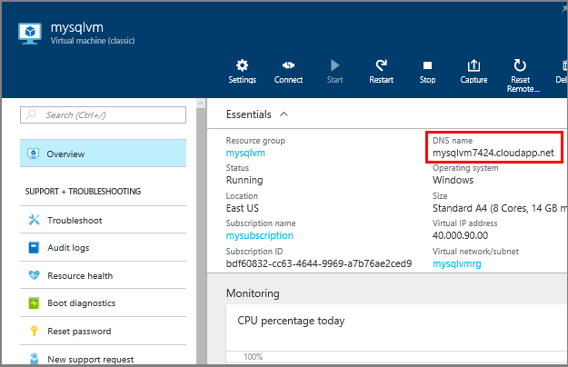
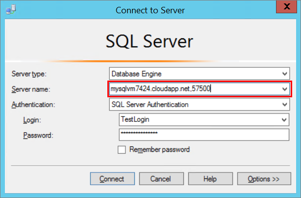
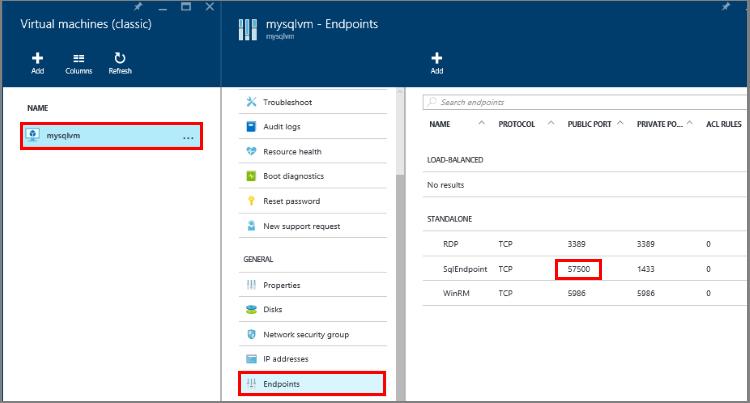

### 确定虚拟机的 DNS 名称
若要从另一台计算机连接到 SQL Server 数据库引擎，必须知道虚拟机的域名系统 (DNS) 名称。 （这是 Internet 用于识别虚拟机的名称。 可以使用 IP 地址，但 IP 地址在 Azure 为冗余或维护而移动资源时可能会变更。 DNS 名称将保持不变，因为可将该名称重定向到新的 IP 地址。）  

1. 在 Azure 门户中（或在完成前一步后），选择“虚拟机(经典)”。
2. 选择 SQL VM。
3. 在“虚拟机”边栏选项卡中，复制虚拟机的“DNS 名称”。

    

### 从其他计算机连接到数据库引擎
1. 在连接到 Internet 的计算机上，打开 SQL Server Management Studio。
2. 在“连接到服务器”或“连接到数据库引擎”对话框的“服务器名称”框中，按“DNSName,portnumber”的格式输入虚拟机的 DNS 名称（在前一任务中确定）和公共终结点端口号，例如“mysqlvm.chinacloudapp.cn,57500”。

    

    如果不记得之前创建的公共终结点端口号，可以在“虚拟机”边栏选项卡的“终结点”区域中找到。

    
3. 在“身份验证”框中，选择“SQL Server 身份验证”。
4. 在“登录名”框中，键入在前面的任务中创建的登录名。
5. 在“密码”框中，键入在前面的任务中创建的登录名的密码。
6. 单击“连接” 。

<!--Update_Description: wording update, update link-->