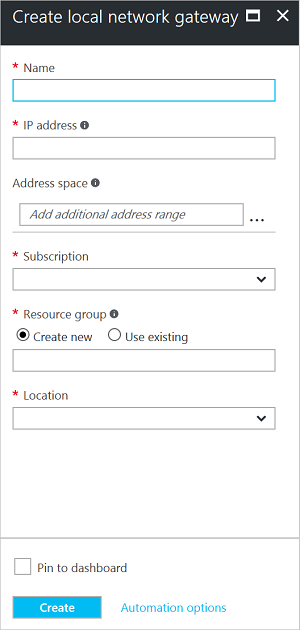

1. 在门户中，从“所有资源”单击“+添加”。
2. 在“所有内容”页搜索框中键入“本地网关”，单击即可返回资源的列表。 单击“本地网络网关”打开相应页，然后单击“创建”打开“创建本地网络网关”页。

    
3. 在“创建本地网络网关”页上，指定本地网络网关的值。

    - **名称**：指定本地网络网关对象的名称。 请尽可能使用直观的名称，例如 **ClassicVNetLocal** 或 **TestVNet1Local**。 这样即可更轻松地在门户中标识本地网关。
    - **IP 地址：** 为要连接的 VPN 设备或虚拟网络网关指定一个有效的公共 **IP 地址**。

      - **如果此本地网络代表本地位置：** 请指定要连接的 VPN 设备的公共 IP 地址。 它不能位于 NAT 后面，并且必须可让 Azure 访问。
      - **如果此本地网络代表另一个 VNet：** 请指定已分配给该 VNet 的虚拟网络网关的公共 IP 地址。
      - 
            **如果还没有 IP 地址：** 可以生成一个有效的占位符 IP 地址，并在连接之前回来修改此设置。
    -  指的是此本地网络所代表的网络的地址范围。 可以添加多个地址空间范围。 请确保此处所指定的范围没有与连接到的其他网络的范围相重叠。
    - **配置 BGP 设置：** 仅在配置 BGP 时使用。 否则，不选择此项。
    - **订阅**：确保显示的是正确订阅。
    - **资源组**：选择要使用的资源组。 可以创建新的资源组或选择已创建的资源组。
    - **位置**：选择将在其中创建此对象的位置。 可选择 VNet 所在的位置，但这不是必须的。
4. 单击“创建”  以创建本地网关。

<!-- ms.date: 12/12/2017 -->