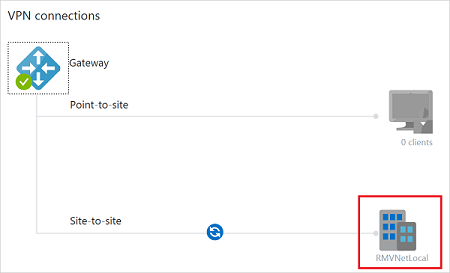
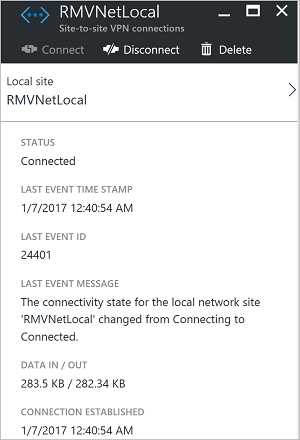

在 Azure 门户中，可通过导航到连接来查看经典 VNet VPN 网关的连接状态。 以下步骤演示导航到连接并进行验证的一种方法。

1. 在 [Azure 门户](http://portal.azure.cn)中单击“所有资源”，然后导航到经典虚拟网络。 
2. 在虚拟网络边栏选项卡中，单击“概述”访问该边栏选项卡的“VPN 连接”部分。  
3. 在 VPN 连接图中单击站点。

    
4. 在“站点到站点 VPN 连接”边栏选项卡中，查看有关站点的信息。 

    
5. 若要查看有关连接的详细信息，请单击连接名称，打开“站点到站点 VPN 连接”  边栏选项卡。

    